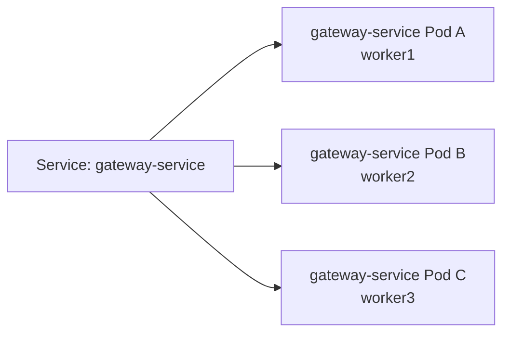

# Kubernetes 多节点部署方案报告

由于电脑配置原因，无法在本机上部署多节点的k8s故多节点部署仅有方案，但未实施
## 1. 方案目标

本方案用于在单台开发机上通过 kind 模拟一个更接近生产环境的 Kubernetes 多节点集群。集群拓扑为：

- 1 个 control-plane 节点
- 3 个 worker 节点
- 业务服务以 Deployment 形式运行
- 中间件以 StatefulSet + PVC 形式运行
- 外部访问由 ingress-nginx 接入，再转发到项目内的 edge-nginx
- 业务服务支持 HPA 自动扩缩容

该方案保留了本项目原有的微服务拆分方式，同时让 Pod 调度、Service 负载均衡、Ingress 入口、HPA 自动扩缩容都能在本机环境中演示。

## 2. 集群节点拓扑

节点规划如下：

| 节点 | 角色 | 说明 |
| --- | --- | --- |
| `cloud-demo-control-plane` | control-plane | Kubernetes API Server、调度器、控制器等控制面组件 |
| `cloud-demo-worker` | worker | 承载业务 Pod 和中间件 Pod |
| `cloud-demo-worker2` | worker | 承载业务 Pod 和中间件 Pod |
| `cloud-demo-worker3` | worker | 承载业务 Pod 和中间件 Pod |

#

## 3. 服务部署方式

### 3.1 无状态业务服务

以下服务使用 Deployment 部署：

- `edge-nginx`
- `gateway-service`
- `user-service`
- `activity-service`
- `announcement-service`
- `feedback-service`
- `monitor-service`
- `mcp-service`

这些服务可以被 Kubernetes 调度到不同 worker 节点上。Service 会为同一服务的多个 Pod 提供稳定访问入口和负载均衡。

### 3.2 有状态中间件

以下组件使用 StatefulSet + PVC 部署：

- MySQL
- Redis
- RabbitMQ
- MinIO
- Nacos

这类组件有数据目录和启动顺序要求，因此不直接使用 HPA 自动扩容。它们的扩容、备份和高可用需要单独设计，例如 MySQL 主从、Redis Sentinel/Cluster、RabbitMQ Cluster、MinIO 分布式模式等。

## 4. 自动扩容设计

本项目配置HPA，允许在负载过大时增加实例

