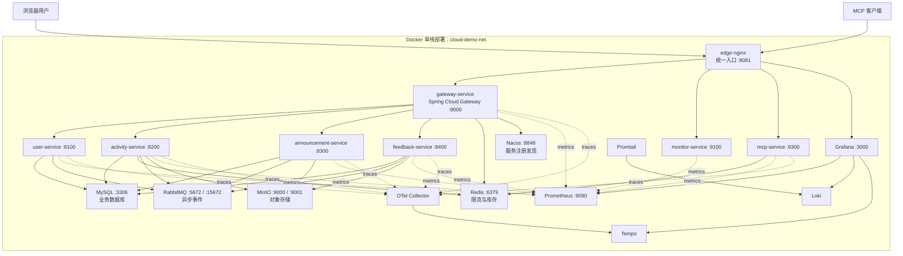

# 《面向服务的计算系统》大作业报告片段：系统架构（单栈部署版）

> 说明：本文由根目录原 Word 报告转换并修订而来，原 `.doc` 文件未被修改。本文只描述当前项目的 Docker 单栈部署形态，删除了旧部署形态中的分流、双环境和多入口相关表述。

## 3. 系统架构

本系统采用前后端分离 + 微服务的总体架构。平台整体由客户端接入层、边缘代理层、网关与服务治理层、业务服务层、平台中间件与数据支撑层、可观测与运维层组成。该架构既满足普通 Web 访问需求，也支持 MCP 客户端调用，并通过 Docker Compose 单栈部署实现本机或单服务器环境下的一键运行。

当前单栈部署以根目录 `docker-compose.yml` 为默认入口，实际 Compose 定义位于 `deploy/docker/docker-compose.yml`。每个后端服务只保留一个容器实例，所有容器接入同一个 Docker 网络 `cloud-demo-net`，由 `edge-nginx` 对外暴露统一入口。

## 3.1 系统架构图



## 3.2 各层具体实现

### 3.2.1 接入层

#### 层定位

接入层负责承接终端用户或外部智能客户端的访问请求。在本项目中，接入层既包括浏览器访问的 Vue 单页应用，也包括 MCP 客户端访问的工具接口和授权入口。

#### 具体功能

| 功能 | 说明 |
| --- | --- |
| 用户 Web 端页面访问 | `frontend2` 使用 Vue 3、Vue Router、Pinia、Axios、Element Plus 构建单页应用，页面包括登录、注册、公告、活动、反馈、个人中心、后台管理等。 |
| API 请求封装 | 前端请求以 `/api` 为统一前缀，登录成功后从本地存储读取 token 并写入 `Authorization: Bearer ...`。 |
| 前端路由访问控制 | 前端路由通过登录状态和用户角色做体验层控制；真正的权限判断由后端根据 Gateway 透传的身份头完成。 |
| 业务入口 | 前端 API 将页面动作映射到 `/user/login`、`/activity/list`、`/announcement/home`、`/feedback/admin/list` 等接口。 |
| MCP 工具接入 | `mcp-service` 注册 `ActivityMcpTools`、`AnnouncementMcpTools`、`FeedbackMcpTools`、`UserMcpTools`，对外提供活动浏览/报名、公告管理、反馈处理、用户信息等工具。 |
| MCP 授权入口 | `AuthController` 暴露 `/.well-known/oauth-protected-resource`、`/.well-known/oauth-authorization-server`、`/register`、`/authorize`、`/token`、`/mcp/auth/login`；`McpAccessTokenFilter` 对 `/mcp` 请求校验 Bearer token。 |

#### 代码与配置依据

- 前端工程：`frontend2`
- MCP 服务源码：`services/mcp-service/src/main/java/org/example/mcp`
- Docker 单栈入口：`docker-compose.yml`
- 单栈 Compose 定义：`deploy/docker/docker-compose.yml`

#### 代码实现方式

Web 前端由 `edge-nginx` 托管静态资源。页面内请求全部以 `/api` 为统一前缀，由 `edge-nginx` 转发到 `gateway-service`。前端登录成功后将 token 存入本地，再由 Axios 拦截器附加到请求头。管理员入口只负责前端体验层控制，后端权限仍依赖 Gateway 透传的 `X-User-Role`。

MCP 服务不直接访问数据库或业务服务，而是通过 `CloudDemoGatewayClient` 调用 Gateway。该客户端会将工具调用规范化为 `/api/...` 路径，并携带当前 MCP 会话中的 gateway token。管理员类 MCP 工具会显式调用 `requestContext.requireAdmin()`。

#### 关键技术

Vue 3、Element Plus、Axios、Spring AI MCP Server、Spring Web MVC、JWT、Spring Boot Actuator、Resilience4j。

#### 与上下层协同

接入层向下依赖边缘代理层暴露的统一入口。浏览器访问 `/` 和 `/api`，MCP 客户端访问 `/mcp`、`/authorize`、`/token` 等路径，这些路径均由 `edge-nginx` 转发到 Gateway 或 MCP 服务。MCP 服务进一步通过 Gateway 进入业务系统，因此它是智能客户端接入适配器，不是独立业务域。

### 3.2.2 边缘代理与流量转发层

#### 层定位

边缘代理与流量转发层承担系统对外 HTTP 入口，负责静态资源服务、API 反向代理、监控/MCP 路径转发、Grafana 路径转发和基础转发头透传。

#### 具体功能

| 功能 | 说明 |
| --- | --- |
| 静态资源服务 | `deploy/docker/edge-nginx/Dockerfile` 构建 `frontend2`，将 `dist` 复制到 Nginx 静态目录。 |
| SPA fallback | `deploy/docker/edge-nginx/nginx.conf` 中 `location / { try_files $uri $uri/ /index.html; }` 支持前端 history 路由。 |
| Gateway 反向代理 | `location ^~ /api/` 直接转发到 `gateway-service:9000`。 |
| 监控入口转发 | `/monitor/` 转发到 `monitor-service:9100`。 |
| MCP 入口转发 | `/.well-known/`、`/authorize`、`/token`、`/register`、`/mcp` 转发到 `mcp-service:9300`。 |
| Grafana 转发 | `/grafana/` 转发到 `grafana:3000`。 |
| 静态资源缓存 | CSS、JS、图片、字体等资源设置 7 天缓存。 |

#### 代码与配置依据

- Nginx 配置：`deploy/docker/edge-nginx/nginx.conf`
- Nginx 镜像构建：`deploy/docker/edge-nginx/Dockerfile`
- Compose 服务定义：`deploy/docker/docker-compose.yml`

#### 代码实现方式

单栈部署中，根目录 `docker-compose.yml` 引用 `deploy/docker/docker-compose.yml`。`edge-nginx` 监听宿主机 `8081` 并映射到容器 `80` 端口。所有后端服务和中间件都位于同一个 Docker 网络 `cloud-demo-net`，因此 Nginx upstream 直接指向服务名：

- `gateway-service:9000`
- `monitor-service:9100`
- `mcp-service:9300`
- `grafana:3000`

请求链路为：

```text
Browser -> edge-nginx -> gateway-service -> user/activity/announcement/feedback
```

#### 关键技术

Nginx 1.27-alpine、Docker multi-stage build、Nginx upstream、反向代理、SPA 静态托管、Docker Compose 网络。

#### 与上下层协同

边缘代理层向上接收浏览器与 MCP 客户端流量，向下将 `/api` 交给 Gateway，将 `/mcp` 和授权相关路径交给 MCP 服务，将 `/monitor/` 交给监控服务，将 `/grafana/` 交给 Grafana。它通过 `X-Forwarded-*`、`X-Real-IP` 等请求头协同下游服务识别真实来源。

### 3.2.3 网关与服务治理层

#### 层定位

网关与服务治理层位于边缘代理之后、业务服务之前，负责内部 API 统一入口、服务发现路由、JWT 认证、用户身份透传、限流、熔断降级、跨域与网关观测。

#### 具体功能

| 功能 | 说明 |
| --- | --- |
| 业务路由 | `gateway-service/application.properties` 定义四条路由：`/api/user/** -> lb://user-service`、`/api/activity/** -> lb://activity-service`、`/api/announcement/** -> lb://announcement-service`、`/api/feedback/** -> lb://feedback-service`。 |
| 路径重写 | 每条路由通过 `RewritePath=/api/(?<segment>.*), /${segment}` 去掉 `/api` 前缀，与业务 Controller 的 `/user`、`/activity`、`/announcement`、`/feedback` 对齐。 |
| JWT 鉴权 | `AuthFilter` 是全局过滤器，白名单放行登录、注册、活动列表、活动图片、公告首页/列表/图片/附件和 `/fallback/`，其他请求必须携带 Bearer token。 |
| 身份透传 | `AuthFilter` 校验 token 后写入 `X-User-Id`、`X-Username`、`X-User-Role`，业务服务根据这些头做用户识别和权限判断。 |
| Trace ID | `AuthFilter` 从 `X-Trace-Id` 读取或生成 UUID，并写回请求和响应。 |
| Redis 限流 | 每条路由都使用 `RequestRateLimiter`，key resolver 为 `ipOrUserKeyResolver`，优先按用户 ID 限流，否则按 IP 限流。 |
| 熔断降级 | 四条路由均配置 CircuitBreaker，对应 `/fallback/{service}` 返回 503、服务名、原因、traceId、timestamp。 |
| 跨域 | Gateway 配置允许任意 origin pattern、method、header，并允许 credentials。 |
| 服务发现 | Gateway 使用 Nacos Discovery 与 Spring Cloud LoadBalancer，通过 `lb://` 访问服务实例。 |

#### 代码与配置依据

- Gateway 配置：`services/gateway-service/src/main/resources/application.properties`
- Gateway 认证过滤器：`services/gateway-service/src/main/java`
- Compose 环境变量与依赖：`deploy/docker/docker-compose.yml`

#### 代码实现方式

`GatewayApplication` 使用 `@EnableDiscoveryClient` 接入 Nacos。路由主要通过配置文件声明。网关过滤器 `AuthFilter` 实现 `GlobalFilter` 与 `Ordered`，顺序为 `-100`，因此会较早执行。Resilience4j 参数在配置文件中定义，包括 count-based sliding window、失败率阈值、慢调用阈值、open 状态等待时间、TimeLimiter 超时等。

#### 关键技术

Spring Cloud Gateway、Spring Cloud LoadBalancer、Nacos Discovery、Redis Reactive、JWT/JJWT、Resilience4j、Micrometer、Actuator、Prometheus。

#### 与上下层协同

上层 `edge-nginx` 将 `/api` 请求转发给 Gateway；Gateway 根据 Nacos 注册信息将请求负载均衡到四个业务服务。业务服务不直接解析前端 JWT，而是信任 Gateway 注入的用户头。Redis 为 Gateway 限流提供令牌桶状态；Nacos 为 Gateway 提供服务实例；Actuator、Prometheus、Tracing 为运维层提供指标和链路数据。

### 3.2.4 业务服务层

#### 层定位

业务服务层承载系统核心领域能力。项目实际拆分为四个业务服务：用户、活动、公告、反馈。每个服务都是独立 Spring Boot 应用，独立端口，独立数据库连接，并通过 Gateway 对外暴露。

#### 业务服务功能

##### user-service

| 功能 | 说明 |
| --- | --- |
| 用户登录 | 按用户名查询 `sys_user`，校验 BCrypt 密码，生成 JWT，返回 token 与用户信息。 |
| 用户注册 | 检查用户名和学号唯一性，默认角色 `VOLUNTEER`，初始志愿时长为 0。 |
| 用户资料 | 查询与更新真实姓名、电话、邮箱。 |
| 修改密码 | 校验旧密码，更新 BCrypt 新密码。 |
| 志愿时长排行/查询 | 管理员接口 `/user/admin/hours` 查询志愿者总时长。 |
| 内部接口 | `/internal/users/hours` 更新志愿时长，`/internal/users/summaries` 批量查询用户摘要。 |
| 消息消费 | `UserUpdatedConsumer` 消费用户时长事件；`FeedbackCreatedConsumer` 消费反馈创建事件并维护用户反馈投影。 |

##### activity-service

| 功能 | 说明 |
| --- | --- |
| 活动列表和详情 | 支持分页、状态、分类、招募阶段过滤，并根据用户 ID 标记是否已报名。 |
| 管理员活动管理 | 创建、编辑、取消、完成、删除活动。 |
| 活动报名 | 使用 Redis 库存 Key 预扣名额，数据库唯一约束防止同一用户重复报名，失败时回补 Redis。 |
| 取消报名 | 更新报名状态、减少当前人数、回补 Redis 名额。 |
| 签到与时长确认 | 管理员可对报名记录签到、确认志愿时长。 |
| 志愿时长事件 | 确认时长后写入 `event_outbox`，由 Outbox Publisher 发布用户时长更新事件。 |
| 活动变更事件 | 创建、更新、取消、完成、删除活动时写入活动 upsert/delete Outbox，用于公告服务维护活动投影。 |
| 活动图片 | 通过 MinIO 上传、读取、删除图片。 |
| Excel 导出 | 使用 Apache POI 导出当前用户已确认的志愿记录。 |
| AI 文案 | AIService 调用 DeepSeek OpenAI 兼容接口生成活动描述，并提供本地 fallback。 |
| 用户摘要远程调用 | `UserServiceClient` 使用 `@LoadBalanced RestTemplate` 调用 user-service 内部接口，并使用 Resilience4j。 |

##### announcement-service

| 功能 | 说明 |
| --- | --- |
| 首页公告 | 查询已发布公告，限制展示数量。 |
| 公告分页与详情 | 仅展示 `PUBLISHED` 状态公告。 |
| 管理员公告管理 | 查询全部公告，创建、更新、发布、下线、删除。 |
| 公告图片 | 上传、访问、删除 MinIO 图片。 |
| 公告附件 | 上传、下载并维护附件元数据。 |
| 关联活动 | 公告可维护一个或多个活动 ID，并在查询时通过本服务内的活动投影表补全活动摘要。 |
| 活动投影消费 | 消费 activity 事件，维护 `vol_announcement_activity_projection`。 |
| 消息幂等 | 消费前检查 `mq_consume_record`，消费后写入消费记录。 |

##### feedback-service

| 功能 | 说明 |
| --- | --- |
| 创建反馈 | 用户提交标题、分类、内容和附件，创建反馈主表与首条消息。 |
| 我的反馈 | 用户按状态分页查看自己的工单。 |
| 管理员列表 | 按状态、分类、优先级、关键字筛选反馈。 |
| 反馈详情 | 普通用户只能看自己的反馈，管理员可查看管理详情。 |
| 用户/管理员回复 | 维护消息列表，并更新反馈状态和最后回复角色。 |
| 关闭/驳回/优先级 | 用户或管理员可关闭，管理员可驳回、设置优先级。 |
| 附件上传与下载 | 通过 MinIO 存储附件，下载前校验用户是否为工单所有者或管理员。 |
| 反馈创建事件 | 创建反馈后写入 `event_outbox`，由 FeedbackOutboxPublisher 发布 feedback.created 事件，供 user-service 建立反馈投影。 |

#### 代码与配置依据

- 用户服务：`services/user-service`
- 活动服务：`services/activity-service`
- 公告服务：`services/announcement-service`
- 反馈服务：`services/feedback-service`
- 服务配置：`services/*/src/main/resources/application.properties`
- Docker 单栈服务定义：`deploy/docker/docker-compose.yml`

#### 关键实现方式

四个业务服务均采用 Controller-Service-Mapper-Entity 的典型分层实现。Controller 负责接收 Gateway 透传的用户头并做角色判断，Service 实现事务、校验和业务流程，Mapper 基于 MyBatis-Plus 访问数据库。业务服务使用 `@MapperScan` 扫描 Mapper，使用 `@EnableDiscoveryClient` 注册到 Nacos；activity 与 feedback 使用定时任务驱动 Outbox 发布。

#### 关键技术

Spring Boot Web、MySQL Connector/J、JJWT、RabbitMQ/Spring AMQP、Redis、MinIO Java SDK、Apache POI、Resilience4j、Spring Cloud LoadBalancer、Actuator、Micrometer。

#### 与上下层协同

业务服务向上只暴露内部 HTTP 接口给 Gateway，不直接对外暴露浏览器入口。服务间同步调用主要出现在 `activity-service` 调用 `user-service` 的内部用户摘要接口；异步协作通过 RabbitMQ 事件实现，包括活动投影、反馈投影、用户志愿时长更新。业务数据落入 MySQL，文件对象落入 MinIO，报名库存与网关限流依赖 Redis。

### 3.2.5 平台中间件与数据支撑层

#### 层定位

平台中间件与数据支撑层为上层业务和治理提供基础能力，包括服务注册发现、关系型数据、缓存/并发控制、消息事件、对象存储，以及单栈 Docker 网络与容器运行环境。

#### 具体功能

##### Nacos

单栈 Compose 启动一个 `nacos` 容器，运行 standalone 模式。服务通过 `spring.cloud.nacos.discovery.server-addr` 注册到 Nacos。Gateway 使用 `lb://服务名` 从 Nacos 发现服务实例。`monitor-service` 也接入 Nacos，用于 Spring Boot Admin 发现服务。

##### MySQL

单栈 Compose 使用 MySQL 8.0。数据库初始化脚本为：

```text
deploy/common/bootstrap-db.sql
```

该脚本创建四个业务库并授予独立用户权限：

1. `user_service_db`
2. `activity_service_db`
3. `announcement_service_db`
4. `feedback_service_db`

业务表按服务拆分：用户表、活动表、报名表、公告表、公告附件表、活动投影表、反馈表、反馈消息表、反馈附件表，以及各服务的 `event_outbox`、`mq_consume_record`。

##### Redis

Redis 由单栈 Compose 中的 `redis` 服务提供。Gateway 使用 `spring-boot-starter-data-redis-reactive` 支撑 `RequestRateLimiter`；`activity-service` 使用 `StringRedisTemplate` 对活动库存执行 `decrement/increment`，防止报名超卖；`mcp-service` 使用 Redis 保存授权相关临时状态。

##### RabbitMQ

RabbitMQ 由单栈 Compose 中的 `rabbitmq` 服务提供，管理端口默认为 `15672`。`activity-service` 与 `feedback-service` 定时扫描 Outbox，发布 `activity.upserted`、`activity.deleted`、`user.updated`、`feedback.created` 等事件。`announcement-service` 消费活动事件维护投影；`user-service` 消费用户时长与反馈创建事件。

##### MinIO

MinIO 由单栈 Compose 中的 `minio` 服务提供。`activity-service`、`announcement-service`、`feedback-service` 均有 `MinioStorageService`，支持上传对象、读取对象、查询对象元信息、删除对象。默认 bucket 为 `activity-images`，被多个服务共享用于活动图片、公告图片/附件、反馈附件。

#### 代码与配置依据

- 单栈 Compose：`deploy/docker/docker-compose.yml`
- 数据库初始化：`deploy/common/bootstrap-db.sql`
- Redis/Gateway 配置：`services/gateway-service/src/main/resources/application.properties`
- 各服务数据源配置：`services/*/src/main/resources/application.properties`

#### 关键技术

Nacos Server、MySQL 8.0、Redis 7、RabbitMQ 3.13 Management、MinIO、Docker Compose、MyBatis-Plus、Spring AMQP、Spring Data Redis、MinIO Java SDK。

#### 与上下层协同

平台中间件支撑网关和业务服务：Nacos 为服务治理层提供实例发现；Redis 为 Gateway 限流、活动库存和 MCP 授权状态提供存储；RabbitMQ 解耦业务服务间事件；MySQL 保存业务状态；MinIO 保存二进制文件。上层服务通过 Spring 配置和 Compose 环境变量连接这些中间件。

### 3.2.6 可观测与运维层

#### 层定位

可观测与运维层负责服务健康检查、指标采集、日志聚合、链路追踪、运行面板和基础部署运维脚本。本项目在 Docker 单栈中使用 Spring Boot Admin、Actuator/Prometheus、Loki/Promtail、Tempo、Grafana、OpenTelemetry Collector。

#### 具体功能

| 功能 | 说明 |
| --- | --- |
| 健康检查 | Compose 中各服务配置 `/actuator/health` 或中间件自带健康检查，并通过 `depends_on.condition` 控制启动依赖。 |
| Actuator 暴露 | 业务服务、Gateway、MCP 均暴露 `health`、`info`、`prometheus`；`monitor-service` 作为 Spring Boot Admin 服务端。 |
| 指标采集 | `deploy/docker/observability/prometheus.yml` 静态抓取 `gateway-service`、`user-service`、`activity-service`、`announcement-service`、`feedback-service`、`monitor-service`、`mcp-service` 的 `/actuator/prometheus`。 |
| 链路追踪 | 各服务配置 `management.otlp.tracing.endpoint=http://otel-collector:4318/v1/traces`，OTel Collector 接收 OTLP 并导出到 Tempo。 |
| 日志聚合 | 服务配置 `logging.file.name` 和统一日志 pattern；Promtail 通过 Docker socket 与日志目录采集容器日志并发送到 Loki。 |
| Grafana 数据源 | `deploy/docker/observability/grafana/provisioning/datasources/datasources.yml` 预置 Prometheus、Loki、Tempo。 |
| Spring Boot Admin | `monitor-service` 使用 `@EnableAdminServer`，可通过 Nacos 发现服务实例并展示运行状态。 |
| 请求日志过滤器 | 四个业务服务、monitor、mcp 均有 `RequestLoggingFilter`，跳过 `/actuator`，记录 HTTP 请求完成情况。 |

#### 代码与配置依据

- Prometheus 配置：`deploy/docker/observability/prometheus.yml`
- Grafana 数据源：`deploy/docker/observability/grafana/provisioning/datasources/datasources.yml`
- OTel Collector 配置：`deploy/docker/observability/otel-collector-config.yml`
- Loki/Promtail/Tempo 配置：`deploy/docker/observability/*`
- 监控服务源码：`services/monitor-service`

#### 代码实现方式

可观测能力由两类机制组成：应用内通过依赖与配置暴露 Actuator、Prometheus 指标、OTLP trace、结构化日志；部署层通过 Prometheus、Promtail、Loki、Tempo、Grafana、OTel Collector 组成采集和展示链路。Spring Boot Admin 作为 Java 服务运维视图，依赖 Nacos 发现业务服务。

#### 关键技术

Spring Boot Actuator、Micrometer Prometheus Registry、Micrometer Tracing OTel Bridge、OpenTelemetry Collector、Tempo、Loki、Promtail、Prometheus、Grafana、Spring Boot Admin、Docker healthcheck、PowerShell/Shell 运维脚本。

#### 与上下层协同

所有业务服务和 Gateway 向运维层暴露 `/actuator/prometheus` 和 trace；日志由容器 stdout/file 被 Promtail 采集；Grafana 统一查询 Prometheus、Loki、Tempo。`monitor-service` 通过 Nacos 发现服务实例并展示运行状态，`edge-nginx` 通过 `/monitor/` 暴露 Spring Boot Admin，通过 `/grafana/` 暴露 Grafana。

## 3.3 单栈部署访问入口

| 入口 | 地址 |
| --- | --- |
| 前台网站 | `http://localhost:8081/` |
| 监控后台 | `http://localhost:8081/monitor/` |
| MCP | `http://localhost:8081/mcp` |
| Grafana | `http://localhost:3000` |
| Prometheus | `http://localhost:9090` |
| Nacos | `http://localhost:8848/nacos` |
| MinIO Console | `http://localhost:9006` |

## 3.4 单栈部署小结

当前 Docker 单栈部署将前端、网关、业务服务、MCP、监控服务和中间件全部放入同一个 Compose 工程内。其优势是部署简单、网络清晰、适合本机演示和单服务器运行；其限制是每个服务默认只有一个容器实例，不承担生产级多节点容灾。若需要多副本、节点调度和自动扩容，可使用本项目 `deploy/k8s` 下的 Kubernetes 部署方案。

